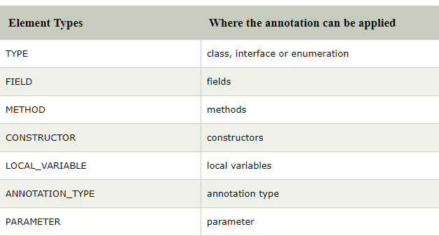

Hello, I’m newbie to Java world & so new to Spring Boot. So, I don’t have a prior experience with spring also. As a new one, I’m writing this to new people to Java. Experts, correct me in the comments if its wrong.

# What is Annotation..?

> a note by way of explanation or comment added to a text or diagram.

Above, is the dictionary explanation for Annotation.

In Java

Annotation is a tag that used for

1.  methods
2.  class
3.  interface

which adds more information about those for Java compiler / JVM(Java Virtual Machine).

You may have already experienced with some built-in Java function when you done with basic Java stuffs.

Like,

1.  @override — used to override the parent class method in sub class method
2.  @SuppressWarnings — used to suppress warnings issued by the compiler.
3.  @Deprecated — compiler prints warning because of the method is deprecated as it could be removed in the future versions. So that its better not to use such method.

Let’s have a look at Java Custom Annotation

Java Custom Annotation or Java User defined annotations are easy to use and create (That means even you and me can create an annotation according to our need).

> **_@interface_** element is used to declare an annotation.

Like this

> **@interface parathan{}**

to create annotation; annotation should have the following characters

-   method should not have parameters
-   should not throw any clause
-   may have default values
-   should return a class, method, enum, String like primitive data type

**Type of Annotation**

1.  Marker Annotation
2.  Single Value Annotation
3.  Multi-value Annotation
4.  Marker Annotation — Annotation that have no methods inside it.

Eg: @Deprecated @Override

> @interface parathan{}

2. Single-value Annotation — Annotation that have one method

> @interface parathan{
> 
> int value();
> 
> }

Default value can be provided for it by following code snippet

> @interface parathan{
> 
> int value() **default** 0;
> 
> }

Applying a Single Annotation in code

> @parathan(value=10)

3.Multi-value Annotation — Annotation that has more method than one

> **@interface** parathan{
> 
> **int** age();
> 
> String name();
> 
> String country();
> 
> }

Applying Multi Annotation can be as follows

> @parathan(age=20,name=”Parathan Thiyagalingam”,country=”Sri Lanka”)

Built in Annotations used in Custom Annotations

1.  @Target
2.  @Retention
3.  @Inherited
4.  @Documented

### 1. **@Target** — 
used to betoken to which type the annotation to be used

For that we have to import **java.lang.annotation.ElementType**

we use

> @Target(ElementType.some_thing)

Here some_thing need to be replaced by the following keywords if you are using where the annotation need to be applied.

If you are going to use it for “class,interface,enumeration”

then

> @Target(ElementType.Type)

If you are going to use it for methods

then

> @Target(ElementType.METHOD)

Credit: Javatpoint.com

Eg to use for class and method is follow

> @Target({ElementType.Type,ElementType.METHOD})
> 
> @interface parathan{
> 
> int age();
> 
> String name();
> 
> }

### 2. **@Retention**

Used to betoken for what level the annotation need to be available.

There are 3 level

-   SOURCE — this refers the source code, which the annotation will not be available in compiled class.
-   CLASS — this refers to the .class file, which the annotation will not available to JVM but available for java compiler. So, it will be in the class file.
-   RUNTIME — refers runtime, which is available to bothe java compiler & jvm.

Eg:

> @Retention(RetentionPolicy.RUNTIME)
> 
> @Target(ElementType.TYPE)
> 
> **@interface** parathan{
> 
> **int** age();
> 
> String name();
> 
> }

The above snippet represents the annotation will be available at the run time & the annotation is targeted to the class.

### 3. **@Inherited** : 
Normally the annotations are not inherited to sub classes to inherit the annotation to sub class @Inherited is used.

> @Inherited
> 
> **@interface** parathan{ } //Now it will be available to subclass also
> 
> **@interface** parathan{ }
> 
> **class** MainClass{}
> 
> **class** Subclass **extends** MainClass{} //sub class extends the super class

As the annotation “**parathan**” is inherited;

the **MainClass** uses the annotation as the **SubClass** extends the **MainClass**,

therefore, the **SubClass** can also access the annotation

### 4.@Documented

It is used to include the annotation in the Java documentation.

The annotation I’m writing here, is because I’m posting [REST API in Java using Spring Boot & MySQL](https://medium.com/@parathanlive123/rest-api-with-spring-boot-mysql-hibernate-jpa-part-1-introduction-only-2c42ab3c0867) as Parts.

So, there we are using a lot of annotations to make our tasks easy.

If I made any mistakes.. Please comment below. Or share with your friends.

Happy Coding Folks…!!

