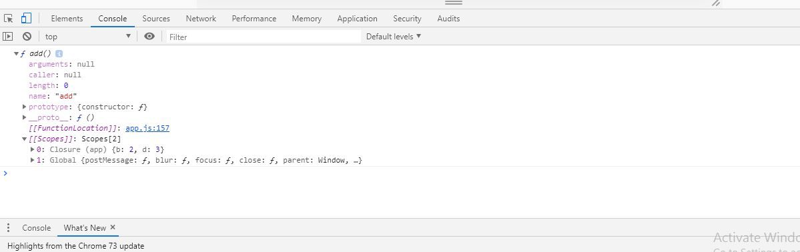

The Closure is a collection of all variables in scope at the time of function creation. To use closure, create a function inside another function which is called a Nested Function. The inner function will have access to the variables in the outer function scope (**Closure** helps to access the outer function scope), even after the outer function has returned. Closures are created every time a function is created.

Before moving on to understand about Closures, let’s first get the big picture about Scope Chain in JavaScript.

Normally, there are 2 types of scope:

-   Global Scope
-   Local Scope

In ES5 version, a variable inside a function is not visible outside. But variables inside a block (conditions like if or while) are visible outside too.

From this, ES5 has function scope. There is no block scope.

> Edited on: 9th May 2019
> 
> According to **ES5**, using functions were the only way to declare a block scope in code.
> 
> But, in ES6 it was eased by **let** & **const** keywords which provides block scope.
> 
> Anyhow, Its better to have a knowledge on how JavaScript evolved step by step.

Lets continue this in ES5 version :
```
var a = 10;  
function app(){  
   var b = 2;  
   console.log(a); // 10  
   console.log(b); // 2  
}  
console.log(b); 
// ReferenceError: b is not defined

app();
```
As we already know, **a** is a Global variable & **b** is a local variable which is **specific** to the app function.

We can’t get the value of a local variable out of the local scope.

## Using a Nested Function — Function inside a Function
```
var a = 10;

function app(){  
     var b = 2;  
     var d = 3; function add(){  
     var c = a + b;  
   } return add;  
}  

var x = app();  
console.dir(x);
```
Here, the app is the parent function & add function is the child function.

-   Rather than using console.log, **console.dir** is used to console all the properties of a specified JavaScript object which helps developers get the properties of that object
-   Variable x is assigned to app function & the app function returns the add function. Therefore we could see all the object properties of the add function.

If you see the console in the browser, you could see the Closure object inside the Scopes array.



Since the inner **function add** accesses the outer function variables **b & d**, those 2 variables will be added to the Closure object for the reference.

Let’s have look at the next example for Closure:
```
var a = 10;  
var startFunc;

function app(){  
      var b = 2; 
   function add() {  
      var c = a + b;  
      console.log(c);  
   } 
   startFunc = add();  
}

app(); 
// Invoke the app functionstartFunc;   

// as the app function invoked above will assign the add function to startFunc & console the value of c
```
-   a Global function called startFunc is assigned to the add function which is a child function of the parent app function.
-   This is possible only after the app function is invoked, otherwise startFunc will act as a global variable without any value assigned

## Application of Closures in JavaScript

Most of us use Closures while coding but we don’t get why we are using it. JavaScript doesn’t have the access modifiers like **private, public, protected** like other Object Oriented Programming Languages. So, we have to use functions to protect the namespace from the outside code usage in ES5.

Especially in functions, **Immediately-invoked Function Expression (IIFE)** is the one which is executed immediately after the declaration. You don’t need to invoke the function after the function is declared.

IIFE enables to write **Module Pattern** (one of the Design Pattern) in JavaScript.

Syntax definition of IIFE is:
```
(function() {  
    //variables & scope that inside the function   
})();
```
Let’s have an example:
```
var studnetEnrollment = (function () {  
     //private variables which no one can change  
     //except the function declared below. 
     var count = 0;  
     var prefix = "S"; 
     // returning a named function expression  
     function innerFunc() {  
         count = count + 1;  
         return prefix + count;  
     };
     return innerFunc;    
})();
     
var x = studnetEnrollment(); // S1  
console.log(x);

var y = studnetEnrollment(); // S2   
console.log(y);
```
count & prefix are the 2 private variables which can’t be changed by anyone & can only be accessible to the inner function (here its innerFunc). This access is possible only by the feature called Closure.

-   At the first time, when the studentEnrollment function is called, the count variable inside the function is incremented 1 by innerFunc function.
-   At the second time, the count is incremented the previous value of count which is 1 to 2
-   These are possible by the Closure feature.

## Conclusion

The Closure is a collection of variables in an outer function which gives access to the inner function scope to protect the global namespace.

Closures enable developers to write clean code like OOP Languages which doesn’t confuse the global & local variable names in ES5 version.

Happy Coding…….!!!!!

