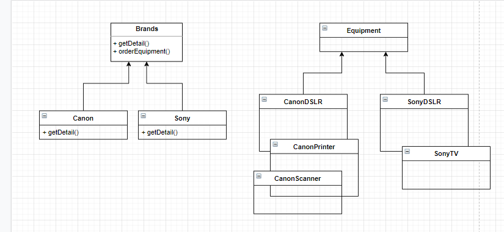

In the last article, we have seen about **Singleton Factory** which belongs to Creational Patterns (Creational Patterns are mainly focused on creating Objects). Today, we are going to have a look at another type of Creational Pattern called **Factory Pattern**.

The word itself illustrates its functionalities.

## What is Factory?

A place where things are created/produced. In factories things are created/produces according to the requirements/orders. Similarly, in the Software development Factory Pattern is implemented to create and execute objects according to the parameters passed.

> The Factory Method Pattern encapsulates to object creation by letting sub-classes to decide what objects to create at run-time (while execution).

In the Factory Pattern, there are 3 different variations are found. They are

-   **Simple Factory:** allows interfaces for **creating objects without exposing the object creation logic to the client**
-   **Factory Method:** allows interfaces for creating objects, but **allow sub-classes** to determine which class to instantiate
-   **Abstract Factory:** an abstract factory provides a way to create families of objects for a group of factories without specifying its concrete class. (We will explore this in our next article.)

So, today we are going to look into Simple Factory and Factory Patterns.

To do a class object creation we use the keyword called **new**.
```
Class() obj = new Class();
```
(**In some cases if you created a static method inside a class and you want to call that method you won’t need to use a new keyword and then to call a static method.**)

> Before moving into the explanation part we need to have a clear understanding of **concrete class**.
> 
> A class that has an implementation for all of its methods is called **Concrete class**. They cannot have any unimplemented methods. The concrete class can extend the Abstract class or an interface as long as its implements all the methods of those too. Simply, we can say that all classes which are not Abstract class are considered as Concrete classes.

Actually, according to Head First Design Patterns, Simple Factory is not considered as a Design Pattern. Let’s get started understanding the Factory Pattern varieties.

# Simple Factory Pattern

The Simple Factory Pattern describes a way of instantiating class using a method with a large conditional that based on **method parameters** to choose which product class to instantiate and then return.

Let’s dive into the coding example where the Simple Factory Pattern comes into play.

Imagine a scenario, where we have different brands of smartphones. You need to take the specification details of the respective brands where the brand name is passed as a parameter through the client code.

## See the following interface and the class implementations.

-   **IMobile** interface
```
public interface **IMobile** {  
       void sendMessage();  
}
```
## Samsung class implementation
```
public class Samsung implements IMobile{ 
    @Override  
    public void sendMessage() {  
          System.out.println("Samsung Selected");  
}}
```
## iPhone Class implementation
```
public class iPhone implements IMobile {
       @Override  
       public void sendMessage() {  
          System.out.println("iPhone Selected ");  
       }  
}
```
The following is the main class which instantiates the classes using objects.

Since I have only 2 classes the following implementation would be fine for now.
```
public class App {
	public static void main(String[] args) {
		IMobile mob1 = new Samsung();      
		mob1.sendMessage(); IMobile mob2 = new iPhone();      
		mob2.sendMessage(); 
        }
}
```
What if we have a lot of brands for smartphones. We need to change the client code whenever new company brands come to the market.

Without affecting the client code section, we are going to create a factory class called MobileFactory. This class will have a **getType** method which returns **IMobile** type by getting an argument and checks through conditional statements and returns the respective concrete class.
```
public class MobileFactory {

	IMobile mobile = null; 

	//getType method will return IMobileobject creation according to the parameter passsed

	IMobile getType (String str) { 
		if(str.equals("Samsung")) {  
			mobile = new Samsung();  
		}else if(str.equals("iPhone")) {  
			mobile = new iPhone();
		}  
		return mobile;  
	}
}
```
Main method implementation would be now as like this
```
public class App {  
	public static void main(String[] args) {
		MobileFactory mobfactory = new MobileFactory(); 
		mobfactory.getType("Samsung").sendMessage(); 
	}  
}
```
From, now onward We don’t have to change anything in the main method (That is **Client code**).

The Simple Factory Pattern is like a basement for the Factory Method Pattern and Abstract Factory Pattern.

In the Simple Factory, we are initiating all concrete classes in the MobileFactory by specifying which mobile name as a parameter and through conditional statements.

But, the MobileFactory has to handle and instantiate all the concrete classes implemented in the program. This could get harder when mobile brands start to produce a different smartphone with several names.

In this case, all the smartphone classes need to be placed in the MobileFactory class under conditional statements. To ease, this difficulty we can create a new Factory for specific smartphone producing companies.

# Factory Method Pattern

**Factory** **Method** **Pattern** says that just **define** **an** **interface** or **an** **abstract** class and let the subclasses decide which class to instantiate.

The Factory Method Pattern is also known as **Virtual Constructor.**

Let's imagine a scenario wherein a showroom has different brands of products to showcase.

We will be implementing this using the Factory Pattern.

-   Create an abstract/interface for Brands
-   Brands will be implemented or extended by the concrete classes. Eg: Canon, Sony
-   Another interface for Equipment that will be extended/implemented by the concrete classes. Eg: CanonDSLR, CanonScanner, SonyTV, and SonyDSLR
-   getDetails() method in the subclasses of Brands will decide which Equipment class will be selected according to the parameter value of Equipment (Eg: Camera, TV, Scanner) passed.

Look at the following UML class diagram explaining this much efficiently.



## Brands abstract class
```
public abstract Brands {

	public Equipment orderEquipment(String equipment) {  
	              Equipment equip;   
	              equip = getDetail(equipment); 
	              return equip; 
	} 
	protected abstract Equipment getDetail(String brandName);

}
```
## Canon class which extends Brands class
```
public Canon extends Brands {
	protected Equipment getDetail(String equipment){
	
		Equipment equip = null;
		
		if(equipment.equals("DSLR")){  
			equip = new CanonDSLR();  
		}else if(equipment.equals("Scanner")){  
			equip = new CannonScanner();  
		}else if(equipment.equals("Printer")){   
			equip = new CanonPrinter()  
		} 
		return equip;
	}  
}
```
Similarly, we can create for the Sony class too.

## Equipment interface (This can be implemented as an abstract class if you want to have any variables or method implementations)
```
public interface Equipment { 
	void printBrand();
}
```
## CanonDSLR class
```
public class CanonDSLR implements Equipment{
    @Override  
    public void printBrand() {  
          System.out.println("Canon DSLR Selected");  
    }
}
```
**Similarly, we can create for other classes like CanonPrinter and SonyTV.**

Now let’s have a look at how to call these program from the **client code**
```
public class App { 
	public static void main(String[] args) { 
		Brands canon1 = new Canon(); 
		Equipment equip1 = canon1.getDetail("DSLR"); equip1.printBrand(); 
	}
}
```
## Usage of the Factory Method Pattern

-   When a class doesn’t know which sub-classes will be required to create
-   When a class wants its subclasses to specify its objects to be created
-   When the parent classes choose the creation of objects to its sub-classes.

Remember: Most of the examples found and Tutorials are discussing The Simple Pattern and Factory Method Patters as mostly the same pattern. But it's not true. I have invested my time in finding the differences for more than 4 days. So, Please shoot any questions if you can’t differentiate the differences.

If you have any doubts or confusions just leave a comment below or connect with me on [Twitter](https://twitter.com/parathantl)

