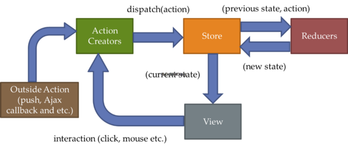

6 hours ago, I was wondered what is **Redux**…?? Got confused & watched some YouTube videos & read some tutorials for 2–3 hours.

Finally, I got an idea & tried some basic stuffs by my own & got succeeded. So, I’m gonna share with you the experience with redux.

Redux is a **State Management framework** to maintain large scaled applications. Redux can be used for both ReactJS and Angular Front-end. Myself mostly familiar with ReactJS, in ReactJS; we set state in construction using “**this.state**” & “**this.setState**” keywords. This is possible in a small application.

If we are going to develop large application, like scheduling employees for a company. We need so much of configurations like time schedule & changing details so on….

At this point Redux comes in to play,




This, is the **simplest diagram** to illustrate the workflow of Redux.

**Store** is the main **holder** of **all the State of the application**. It will **render** the **current state of application to the Front-End**.

If there any **actions** created in View side; it will **trigger** some **actions to Action Creators in Redux**. Then we have to **dispatch that action to the store.**

At the same time **Reducer** in Redux **takes currentState of the application & the state from the Action Creator**. Then **compare those two and send them back to the store** to change the state.

Let’s see one by one.

1.  **Store** : responsible for the entire state of your application.

A method called **createStore()** on the Redux object, which you use to create the store. This method takes a **reducer** function as a required argument.

For example
```
const store = Redux.createStore(reducer_Name);
```
Now, we’ll see What is reducer..?

2. **Reducer** : As defined earlier reducer is a function which takes current state & the state changed by the action creator & compares them & return the state.
```
let initialState = 0;  
const reducer = (currentState= initialState, stateFromAction) => {  
	//Here it will compare the state of initialSate & stateFromAction & //if there any changes then  
	//currentState = stateFromAction  
	//if no changes currentState= initialState

	return currentSatate;
}
```
Finally it will return **currentState**

3. **Action Creator & Actions** : All state changes are initiated by dispatching actions. Action is similarly like JavaScript Object that contains the event of the action which has happened. As its an object. it should has an attribute of ‘**type**’ which defines the type of action happened.

For example a login event has occurred. So, the type is **LOGIN** (Normally action values are written in capital letters.)

Action Creator is a function which returns the action which was done in the View layer.

For example :

```
const action = {type: 'LOGIN'}

// Define an action creator here:

function actionCreator(){
	return action;
};
```
Now, we have to pass the action that has happened to to store to change the store’s current state. For that, we have to dispatch the action to the store. There after reducer will compare the current state & the state from the action & send back the original current state to the store to change the View.

```
store.dispatch(actionCreator());
```

The above code will dispatch the action to the store.

Let’s try a simple Counter Application in Redux

```
// define a constant for increment action types  
const INCREMENT = 'INCREMENT';

// define a constant for decrement action types
const DECREMENT = 'DECREMENT'; 
let initialState = 0;
const counterReducer = (state = initialState, action) =>{switch(action.type){  
   case INCREMENT:  
       return state + 1;  
       break;  
   case DECREMENT :  
       return state -1;  
       break;  
   default:  
       return state;  
       break;  
}  
};
// define an action creator for incrementing

const incAction** = () => {  
  return {  
     type: INCREMENT  
}};
// define an action creator for decrementing

const decAction = ()=>{  
   return {  
      type: DECREMENT  
}};

const store = Redux.createStore(counterReducer);

// define the Redux store here, passing in your reducers
```
To avoid the inconvenience with Strings I already declared the strings to variables.

incAction & decAction are action creator function, (Without creating action and returning them inside an action creator function; I’m totally creating it within an action creator)

You may use any data structures like for loop, while loop & switch cases inside the reducer function according to your application preferences.

Switch case takes the argument of **action.type** (here type is the attribute, value we put in the action creator function)& checks for the possibilities & return the suitable functionalities.

Here you may have noticed that the initial state is not directly assigned to the current state. We are taking a copy of the initial state and then manipulate them. **You should never Mutate the State.**

I think these are the main things you have to consider as a beginner for Redux. Since, I’m also a beginner I have tried my best to write what I have experienced about redux. If there any corrections please mention them in comment section.

Happy Coding Folks…!!!

