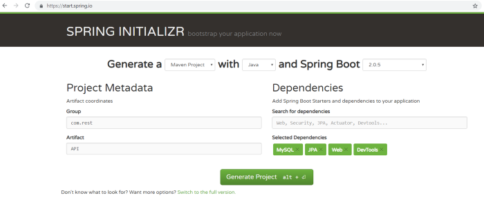
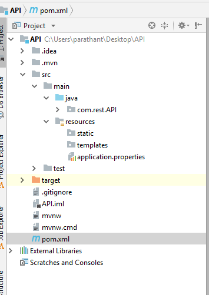
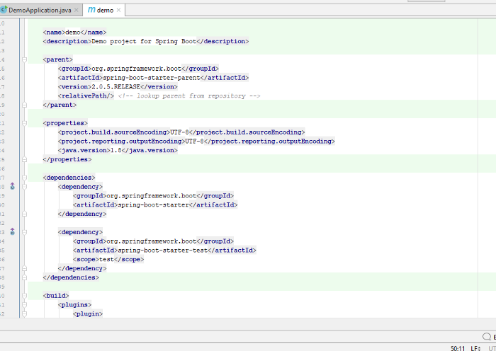

Hi Everyone! For the past year, I have been learning JavaScript for full-stack web development. For a change, I started to master Java — the powerful Object Oriented Language.

In that case, I found a very clean and elegant framework called Spring Boot to build a back end.

Previously, in JavaScript development, I used:

1.  Mongoose — an ORM (Object Relational Mapping) for Mongo DB
2.  Sequelize — an ORM for MySQL

For Java-related development, there are lot of ORM’s like **Hibernate, JPA** (Java Persistence API) & **Java Object Oriented Querying.**

I choose to build with JPA which is traditionally used in Java applications.

It was very interesting, and took about one week to finish as I had to learn Spring Boot (There are a lot of annotations “**@**” and other cool kinds of stuff to learn), JPA, and Hibernate along the way.

All this magic is mostly done by the **annotations** (“**@**” symbol) used in Spring Boot.

## Creating a Spring Boot Maven Project

Let’s create a Spring Boot Maven Project Application using this [link](https://start.spring.io/).

“**Maven**” is a project management tool used to manage dependency management. It’s just like Node Package Manager (**NPM**) in the JS development environment.



We have **package.json in NodeJS** for dependency management and **pom.xml in Spring Boot** for dependency management.

In Group, write whatever the name you want. Usually, the domain name of the organization is written right to left.

For example our domain name is [www.javaAPI.com](http://www.javaAPI.com), so the group name could be **com.javaAPI.www**

Then in the Artifact type the **name of the folder you want**.

On the right side, add the following dependencies:

1.  WEB — To use the dependencies of Spring (The older framework of Spring Boot used to develop web applications)
2.  JPA — Java Persistence API
3.  MYSQL

Then click “Generate Project”. You will find a rar file — extract it. Then open that folder in your favorite IDE.



Click on the **com.rest.API** and you will find an **ApiApplication.java** file as follows:
```
package com.rest.API;

import org.springframework.boot.SpringApplication;  
import org.springframework.boot.autoconfigure.SpringBootApplication;

@SpringBootApplication  
public class ApiApplication {public static void main(String[] args) {  
      SpringApplication._run_(ApiApplication.class, args);  
   }  
}
```
This code is enough to start your server. Normally spring boot runs on **localhost:8080**.

Type in your terminal as follows:

> **mvn spring-boot:run**

See your localhost running in the web browser at port 8080. It looks blank as we haven’t done anything yet.

## Let’s explore the files and their tags

If you have a look at the pom.xml file you may notice that the dependencies you put in when creating the application in Spring Initialize like MySQL, JPA, and Web will be inside a **<dependency>** tag.


The starter and tester dependencies are the core for creating the Spring Boot Application to serve on the server.

Now, let’s move to APIApplication.java which is the main file.
```
package com.rest.API;
import org.springframework.boot.SpringApplication;  
import org.springframework.boot.autoconfigure.SpringBootApplication;

@SpringBootApplication  
public class ApiApplication {**public static void** main(String[] args) {  
      SpringApplication._run_(ApiApplication.class, args);  
   }  
}
```
Here the name of the package is in the first line of the code. Using that package name, you can import any class, method, or instances in another package file.

After that, two modules are imported from “org.springframework.boot” package.

1.  SpringApplication
2.  SpringBootApplication

Since Spring boot is the latest application developing framework of Spring, it needs the packages of Spring Application as well as its specific packages.

After that **@SpringBootApplication** Annotation is used. This Annotation consists of annotation which is used in Spring:

1.  **@Component** — Tells the compiler that the following class is a component which should be included when compiling the whole application.
2.  **@ComponentScan** — This one does the Scan of which packages we are going to use in the following Java class.
3.  **@EnableAutoConfiguration** — enables Spring Boot’s autoconfiguration mechanism to import important modules for the Spring Boot to run.

These are the annotations used to start the Spring Boot Application to run on a server.

Here is an article I have written about [Annotation & their uses in Java](https://medium.com/@parathanlive123/annotation-their-uses-in-java-4285c9413365).

# Let’s create Model for our data

Let’s create a Model class to save, retrieve, update and delete the details of a book.

For that, I have to create a new package named **model** and inside that creating a **Book.java** class to put my code.
```
package com.rest.API.model;
import javax.persistence.*;  
import javax.validation.constraints.NotBlank;

@Entity  
@Table(name = "books")

public class Book {  
    @Id  
    @GeneratedValue  
    private Long id;
    @NotBlank  
    private String book_name;
    @NotBlank  
    private String author_name;
    @NotBlank  
    private String isbn;

    public Book(){  
        super();  
    }
    public Book(Long id, String book_name, String author_name, String isbn) {  
        super();  
        this.id = id;  
        this.book_name = book_name;  
        this.author_name = author_name;  
        this.isbn=isbn;  
    }public Long getId() {  
        return id;  
    }public void setId(Long id) {  
        this.id = id;  
    }public String getBook_name() {  
        return book_name;  
    }public void setBook_name(String book_name) {  
        this.book_name = book_name;  
    }public String getAuthor_name() {  
        return author_name;  
    }public void setAuthor_name(String author_name) {  
        this.author_name = author_name;  
    }public String getIsbn() {  
        return isbn;  
    }public void setIsbn(String isbn) {  
        this.isbn = isbn;  
    }}
```
Here I’m using JPA (Java Persistence API) which is a collection of classes and methods to continuously store data into a database.

**@Entity** — used to denote that this class is going to be an Entity in the database.

**@Table** — which takes some values like the name you are going to name your table

**@Id** — denotes that the id is the primary key / identifying key for this table

**@NotBlank —** is used to say that these attributes should not be blank.

Other than that there is an empty constructor which has a super method to satisfy the JPA customs. Getter and setter methods are usually in a POJO class (**Plain old Java object**).

# Creating the Repository

Next, we are going to create a **repository** package to deal with database management in Java.

Create an Interface called **BookRepository.java** inside the **repository** package.
```
package com.rest.API.repository;

import com.rest.API.model.Book;  
import org.springframework.data.jpa.repository.JpaRepository;  
import org.springframework.stereotype.Repository;

@Repository  
public interface BookRepository extends JpaRepository <Book, Long> {}
```
I have imported the **JpaRepository** package to use that repository in the **BookRepository** interface by connecting my most recently coded Book model to do **CRUD** operations.

There are already built-in methods in those repositories to do CRUD operations.

Eg:
```
.findAll() - to get All datas  
.save()    - to save the got Data  
.delete()  - to delete the data
```
Inside the **<>** tag we are taking the Model name we are going to use and the Primary key’s datatype.

**@Repository**: Annotation used to Indicate the DAO (**Data Access Object**) component in the persistence layer.

It tells the compiler that the interface is going to use the Repository to do database activities.

## Creating Controller and Exception Handling

Create a new package called **controller,** and  inside that create a **BookController.java** file which contains the endpoints.
```
package com.rest.API.controller;

import com.rest.API.exception.BookNotFoundException;  
import com.rest.API.model.Book;  
import com.rest.API.repository.BookRepository;  
import org.springframework.beans.factory.annotation.Autowired;  
import org.springframework.web.bind.annotation.*;  
import org.springframework.http.ResponseEntity;  
import javax.validation.Valid;  
import java.util.List;

@RestController
public class BookController {

@Autowired  
    BookRepository bookRepository;
    
    // Get All Notes
    @GetMapping("/books")  
    public List<Book> getAllNotes() {  
        return bookRepository.findAll();  
    }
    
   // Create a new Note
   @PostMapping("/books")  
   public Book createNote(@Valid @RequestBody Book book) {  
        return bookRepository.save(book);  
    }

   // Get a Single Note
   @GetMapping("/books/{id}")  
   public Book getNoteById(@PathVariable(value = "id") Long bookId) throws BookNotFoundException 
   {  
        return bookRepository.findById(bookId).orElseThrow(() -> new BookNotFoundException(bookId));  
    }

    // Update a Note_ @PutMapping("/books/{id}")
	public Book updateNote(@PathVariable(value = "id") Long bookId, @Valid @RequestBody Book bookDetails) throws BookNotFoundException 
	{
		Book book = bookRepository.findById(bookId).orElseThrow(() -> new BookNotFoundException(bookId));
		book.setBook_name(bookDetails.getBook_name());
		book.setAuthor_name(bookDetails.getAuthor_name());
		book.setIsbn(bookDetails.getIsbn());

		Book updatedBook = bookRepository.save(book);
		return updatedBook;  
	}

   // Delete a Note
    @DeleteMapping("/books/{id}")  
    public ResponseEntity<?> deleteBook(@PathVariable(value = "id") Long bookId) throws BookNotFoundException {  
        Book book = bookRepository.findById(bookId)  
                .orElseThrow(() -> new BookNotFoundException(bookId));
                bookRepository.delete(book);
                return ResponseEntity._ok_().build();  
    }  
}
```
The first imported package is for the Book Not Found exception (for which we are going to create a file in a bit).

**Explanation of Annotations we used here:**

1.  **RestController:** This annotation is used to denote every method in the annotated class as Domain Object.

So what is Domain Object…?

It simply says that Domain Object == Business Object.

They are usually represented by entities and value objects related to the endpoint we are giving to get the data from the database.

2. **Autowired**: This annotation is used to wire the bean classes automatically.

For that, you need to know about “**What is a bean Class..?**”

Basically, a Java Bean Class is a simple class which encapsulates many objects into it.

This is an article I wrote on [Java Bean Classes](https://medium.com/@parathantl/java-bean-class-804c6431a57f).

The following are the Mapping Annotations for the endpoints to perform CRUD Operations.

3. **GetMapping:** This is an **interface** which contains the path of the endpoint to perform a Get method. This GetMapping interface uses the RequestMapping interface which can have the “path, value, params, headers” method to perform the Get method in earlier Spring versions.

Now it’s simplified by using **GetMapping.**

4. **PostMapping**: This is an **interface** which contains the path of the endpoint to perform the Post method.

5. **PutMapping:** This is an **interface** which contains the path of the endpoint to perform the Put method to Update.

6. **DeleteMapping:** This is an **interface** which contains the path of the endpoint to perform the Delete method.

In the final lines, you probably noticed the “**ResponseEntity**” keyword.

What is **that**…??

It’s a Java class which inherits **HttpEntity** class to manipulate the HTTP Responses. Whether the request of the connection is “**OK**” or if there are any problems, throw an **exception** from the **HttpEntity** class.

**orElseThrow():** This is a method found in the **Optional class in Java8** which was introduced to handle Exceptions. The optional class provides various utility methods to check the presence or absence of an object, which helps to deal with NullPointerException.

**orElseThrow** is a method that Returns value if present, otherwise invokes an exception.

## Creating a NotFoundException if there is no such book_id

As orElseThrow method throws a NotFound Exception. The following is the Exception Handling part. Create a **BookNotFoundException.java** file inside exception package.
```
package com.rest.API.exception;

public class BookNotFoundException extends Exception 
{
	private long book_id;
	
	public BookNotFoundException(long book_id) {  
	        super(String._format_("Book is not found with id '%s'", book_id));  
	}
}
```
The created class extends the Superclass of Exception. In the constructor, I’m passing the book_id & prints the exception.

So, that’s it…

We have finished the REST API part. Now you can build the app (which was explained in Part 1) and do some Testings with Postman.

## Connecting with MySql Database

Inside the **application.properties** of your **resources** folder, add the following:
```
## Spring DATASOURCE (DataSourceAutoConfiguration & DataSourceProperties)
spring.datasource.url = jdbc:mysql://localhost:3306/library  
spring.datasource.username = root //normally put your MySQL username   
spring.datasource.password = YOUR_MYSQL_PASSWORD

## Hibernate Properties  
# The SQL dialect makes Hibernate generate better SQL for the chosen database  
spring.jpa.properties.hibernate.dialect = org.hibernate.dialect.MySQL5InnoDBDialect_

# Hibernate ddl auto (create, create-drop, validate, update)  
spring.jpa.hibernate.ddl-auto = update
```
That’s it.

We have built a basic REST API in Spring Boot. Congrats!

If anything is wrong or need to be corrected, please let me know in the comments section.

Get in touch with me on [twitter](https://twitter.com/Parathantl).

Happy Coding!

