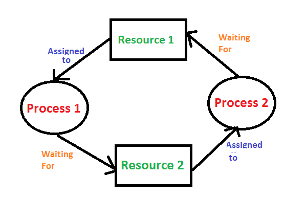

Deadlock is a condition where each process holding a resource and waiting to acquire a resource held by another process.

According to the illustration,

Resource 1 is allocated to Process1 and Resource 2 is allocated to Process 2. At the same time, Process 1 is waiting for Resource 2 which was assigned to Process 2 still. So, Process 1 will be in the waiting state to release Resource 2 by Process 1. Similarly, Process 2 is waiting for Resource 1 which was already assigned to Process 1. So, Process 2 will be in the waiting state.

A process in the Operating System will use resources in the following way

-   Request a resource
-   Use the resource
-   Releases the resource

# Condition for Deadlock

-   **Mutual exclusion**: The resources can not be shareable. Only one process can use the resource at a time. One process after that another process and then another process like it goes. Since the resources are not sharable, then deadlock will occur.
-   **Hold and Wait**: When a process is holding at least one resource and waiting/requesting for another resource deadlock will occur.
-   **No preemption**: A resource can be only voluntarily released by the process itself. A resource can not be taken from a process unless the resource holding process releases that resource.
-   **Circular wait**: A set of processes waiting for each other to form a chain structure. Refer to the image at the start of this post to know about the circular wait. The process waits for another process to release the resource and goes on and the final process waits for the first process to release its resource.

The above 4 conditions will lead to deadlock.

# Methods to handle Deadlock

-   Deadlock ignorance
-   Deadlock Prevention
-   Deadlock Avoidance
-   Deadlock detection and Recovery

1.  **Deadlock ignorance**

Most of the OS tries to ignore deadlock. The deadlock occurs very rarely in OS. If it happens the OS gets hanged. If it gets hanged, usually restarting the system will make the OS work normally as before.

Imagine a method of inserting a deadlock handling code to the OS resource code, it needs to run the code in deadlock handling code part when there any deadlock occurs or when booting. This may cause system performance and speed to decrease. So, the OS resource code doesn't include resource code.

Usually, Windows and Unix OS platforms use this type of method to handle deadlock.

**2. Deadlock Prevention**

The system checks each transaction before it is executed to make sure deadlock won’t occur. If there is some issue will lead to deadlock, it won’t allow the system to execute.

Since we know there are 4 conditions causes the deadlock;

Removing/making false at least anyone of the 4 conditions or try to make false/remove all the 4 conditions that lead to deadlock will prevent the system from deadlock.

How it can be done

-   **Make mutual exclusion false**: Just by sharing the resources deadlock will be prevented. It is possible only in some cases. For example: Take printer it can not be shared with different processes to print pages. It will become complex or can not handle that much easily
-   **Make no preemption false (preemption is true)**: Using time quantum method, preemption can be done. (_Allocating a particular time duration to access the resources is called the time quantum method._) For example, There are 3 processes trying to access a Resource R1, P1 process access Resource 1 for the first 3 milliseconds, then another 3 milliseconds process P2 access, while P1 access any other Resource which is needed for its execution and free at that time. Then P2 changes and P3 access Resource 1 for another 3 milliseconds it goes until the process runs fully,
-   **Make hold and wait false**: Trying to give all resources to the other process/trying to acquire the resource once it finished execution without holding it for so long time.
-   **Circular wait**: To remove circular wait; numbering to all resources like CPU -1, Printer — 2. and making the process to access resources in a particular order (increasing order decreasing order). In this case, a process will access the first CPU then Printer.

3. **Deadlock avoidance**:

It's better to avoid a situation like a deadlock than make it a way to occur and then solving it. The simplest and most useful model requires that each process declare max no.of resources that it may need.

The deadlock avoidance algorithm dynamically examines the resource allocation. Therefore Circular wait condition will never occur.

Basic facts of Deadlock avoidance are:

1.  If a system in a safe state => no deadlock
2.  If a system is in an unsafe state =? possibility of deadlock

These algorithms will ensure that a system will never enter an unsafe state

I hope you got a small knowledge of what is a deadlock and how they handled and what are the conditions make deadlock to happen.

