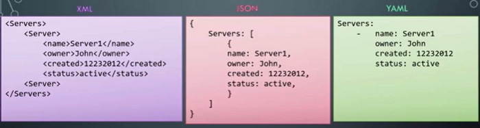

Have you ever seen a file with the extensions .yml | .yaml? If yes, You may have opened it to explore what it is and what will it do? If no. No worries lets take a look at that what it is?

# What is YAML?

> **YAML Ain’t Markup Language (YAML)**
> 
> YAML is a human friendly data serialization standard for all programming languages. Yes, it can work with most of the programming languages without any hastle. — Wikipedia


Courtesy: Wikipedia

Have you used XML and JSON? Have you ever tried these two? Let’s compare these 3 at a glance.



If you can get what this structure is we can do some coding exercise related to it next?

Or else if you are still not clear let me explain to you a sample scenario to explain this.

Scene: You are having a bunch of data that need to get parsed to the webpage i.e to the front-end from an external file. In the early days, XML was used to parse data to the front-end. The following is the structure we have to write in the file and the file has the extension as .xml

I am going to save the personal details in this file and want to get it to the front-end.
```
<Person>  
     <name>Parathan</name>  
     <age>22</name>  
     <email>parathan98@gmail.com</a>  
</Person>
```
After this, we can use specific programming models to get the details in this file to the front-end.

Then, JOSON came into the picture. Since we are using JavaScript in front-end development and in back-end development too JSON is called JavaScript Object Notation. This helped most of the developers to not take much time since they already know JS.

Let’s see how we can write in the JSON
```
{  
Person:[  
   {  
    name: "Parathan",  
    age:22,   
    email: "parathan98@gmail.com"   
    }  
  ]  
}
```
This is similar to Objects concept in JavaScript and mostly a better readable format for developers.

Similarly, YAML also provides better readability and easiness to the people who write YAML related configurations during the development.

**YAML is used in Ansible.**

> Ansible is an open-source software provisioning, configuration management, and application-deployment tool.
> 
> It runs on many Unix-like systems, and can configure both Unix-like systems as well as Microsoft Windows. It includes its own declarative language to describe system configuration. Ansible was written by Michael DeHaan and acquired by Red Hat in 2015. Ansible is agentless, temporarily connecting remotely via SSH or Windows Remote Management (allowing remote PowerShell execution) to do its tasks.

Ansible is mostly used in DevOps automation tasks to deploy or installing applications and Softwares into a new environment. So, a person doesn’t need to be there to configure and install modules/dependencies one by one into a single environment.

I just give it to you to learn by yourself to learn about Ansible. Ansible might be very helpful for your future developments too.

The same JSON and XML file can be simply written in YAML as follows.
```
Person  
- name: "Parathan"  
  age: 22  
  email: "parathan98@gmail.com"
```
Are you wondering what is this? Is it something like a notebook where you point out the details?

Yeah, YAML gives a simple way to write your configurations/data as much as simple and human-readable.

# Let’s make some hands-on experience with YAML…

-   **Comments in YAML**: Comments are a useful method that helps the developers to know what a particular block of code is doing. Similarly here we use # as like Python comment syntax to make comments
```
Person  
- name: Gates # name  
  age: 64 # age
```
In YAML only single-line comment is available NO MULTI-LINE COMMENTS. You have to use **#** for every line.

-   **Multiple Documents in One file:** If you want to have separate properties and values inside one YAML file. This feature also YAML offers. Simply, you have to start with 3 hyphens ( — -) and ends with 3 hyphens ( — -)

```
---  
name: Medium,  
url: [www.medium.com](http://www.medium.com)  
------  
name: Twitter  
url: [www.twitter.com](http://www.twitter.com)  
---
```
I used the Python module YAML to test this

```
import yaml

if __name__ == '__main__':  
    stream = open("foo.yaml", 'r')  
    dictionary = yaml.load_all(stream)
    
    for doc in dictionary:  
	    print("New document:")
	    for key, value in doc.items():
		    print(key + " : " + str(value))
		    if type(value) is list:
			    print(str(len(value)))
```

Following is the output you will get

```
New Document  
name: Medium,  
url: [www.medium.com](http://www.medium.com)  
New Document  
name: Twitter  
url: [www.twitter.com](http://www.twitter.com)
```

- Formatting using YAML:

In some cases, we may have to put a long sentence but in the YAML file, we may have to press ENTER for reading compatibility. But that entered places should not be shown when reading the YAML file.

```
bar: this is not a normal string it spans more than one line see?
```
In here, we will get as Python Dictionary
```
{'bar': 'this is not a normal string it spans more than one line see?'}
```
Take this as another example
```
bar:   
  this is   
  not a normal   
  string it spans   
  more than one line see?
```
If we want to get the same as in the file.

Then we have to add **|-** after :
```
bar: |-  
  this is   
  not a normal   
  string it spans   
  more than one line see?
```
We will get this dictionary format as output in Python
```
{'bar': 'this is \nnot a normal \nstring it spans \nmore than one line see?'}
```
You can notice that there is a new line (**\n**) syntax is added inside the dictionary.

I think you may have got some basic into YAML. I am attaching some YouTube videos and Tutorials guide for your reference.

-   [Properties Vs YAML — What is the difference? | Why everyone is using YAML? Tech Primers](https://www.youtube.com/watch?v=EvEM1FQlFpQ)
-   [YAML | In One Video](https://www.youtube.com/watch?v=cdLNKUoMc6c)
-   [YAML Tutorial](https://www.tutorialspoint.com/yaml/index.htm)

