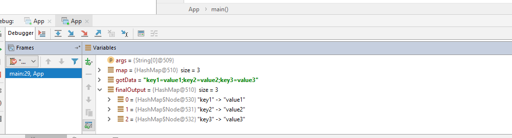

Hi, everyone. I’m learning the basic concepts of Java since last month. So, while I’m learning I did some example by my own. In future post I’m planning to publish those code with you about what I learnt & how I did it.


Here, I want to show you how I split & mapped a string which in the following format.

> key1=value1;key2=value2;key3=value3

This is my code

```
import java.util.*;  
  
public class App {  
  
    public static void main (String args[]) {  
  
        Map<String, String> map = new HashMap<String, String>(); 
        String gotData = "key1=value1;key2=value2;key3=value3";
        
        if(gotData == **""**){ 
        	map = null;
	} else {  
  
   		for(String keyValue : gotData.split(";")) {  
        		String[] key = keyValue.split("=");  
        		map.put(key[0], key[1]);  
    		} 
	}  
        Map<String,String> finalOutput= map;  
  
        System.**_out_**.println(finalOutput);  
  
    }  
}
```
Could you get it out…??

I’m explain it according to my knowledge…

I imported all java.util package modules to use “Map, Hash Map, put” keyword which are belong to the util package.

Then in the App class I declared a _map_ of datatype **Map**.

For loop is used to loop until the string fully read by the program.

Inside that if else is used to avoid the “ArrayBoundExcaption” which is very common exception when using Map, Arrays in Java.

Splitting the string by “ **;** ” and “ **=** ” and assigning the key to the o th index of Map & value to the 1st index of Map

This is what I got as the output

> {key1=value1, key2=value2, key3=value3}



Screenshot of What I got as Output using Debugger mode

for o (zero(th Index

value1 assigned to key1

value2 assigned to key2

value3 assigned to key3

If you have another simple code Share it in the comment.

Thanks,

