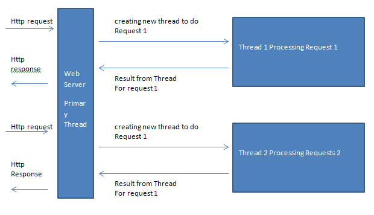
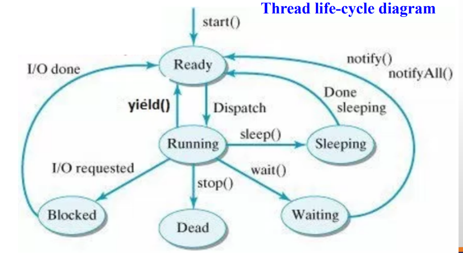

Have you ever wondered how big applications or software are working? Imagine while you are playing video games you may have seen some occurrences where changes occur concurrently like meter measurements or the moving objects in the display. These won’t happen at the same time. Each action is executed under a Thread. But those thread execution changes within **milliseconds**, to our naked eye we can’t observer what’s happening

> An application can have multiple processes, the process can have multiple threads.

To know about Threads we need to know about Process.

Refer the following Wikipedia Definition for Thread and Process

> In computer science, a thread of execution is the smallest sequence of programmed instructions that can be managed independently by a scheduler, which is typically a part of the operating system.

> The implementation of threads and processes differs between operating systems, but in most cases a thread is a component of a process.

> Multiple threads can exist within one process, executing concurrently and sharing resources such as memory, while different processes do not share these resources.

> In particular, the threads of a process share its executable code and the values of its dynamically allocated variables and non-thread-local global variables at any given time.

## Process

-   The process starts with a single thread [Primary Thread] and later can create more Thread from any of its Threads.
-   A process has at least one thread
-   All Threads of a Process have to access its memory and System resources

## Threads

-   The smallest unit of execution to which processor allocates time

Threads consist of the following

-   Program Counter: (contains the address of the next instruction to be executed)
-   a Stack
-   Set of registers
-   A unique id
-   However, a thread itself is not a program. It cannot run on its own but runs within a program

Let’s have a look at a simple explanation of the following picture to understand Threads.

A web server is running on the internet. While running it will have a primary thread inside a process. The process’s main intention is to handle HTTP requests to the server.

When a new request comes it will create a new thread inside that process and send a response to the request.

## Threads VS Process

-   Threads are easier to create than processes since they don’t require a separate address space.
-   Threads are considered lightweight because they use far fewer resources than processes.
-   Processes are typically independent, while threads exist as subsets of a process
-   Processes have separate address spaces, whereas threads share their address space
-   Context switching between threads in the same process is typically faster than context switching between processes.

If you want to know about [context-switching](https://en.wikipedia.org/wiki/Context_switch) refer this link to get to know about it

## Thread Life-cycle diagram

Thread has the following state while its execute

-   Ready
-   Running
-   Sleeping
-   Waiting
-   Dead
-   Blocked

When I/O request interrupted the execution it will move to Blocked state and when the request is done will move to Ready state.

Methods in the arrow indication are used in Java to change the state of a thread.

## In the next article, we will see the coding implementation of Thread in Java

Follow me on [Twitter](https://twitter.com/parathantl)

