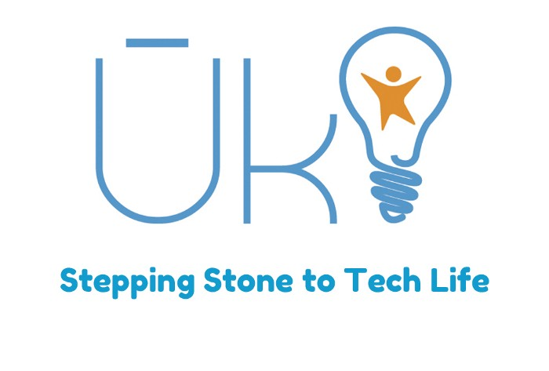

> The youth need to be enabled to become job generators from job seekers — A.P.J.Abdul Kalam

Uki is a Tamil word which means a Catalyst for the youth of Jaffna & Sri Lanka. It provides 6 months scholarship based coding accelerator program for the students who don’t get access to the state university or any other vocational education.

Information Technology is one of the fastest booming & most significant field in Sri Lanka. Uki is a gateway for the students who are really fond of IT & technology.

Preparing the local youth by  elevating their talents & skills to get an industrial internship experience in the Tech Companies around Sri Lanka is the root concept of creation behind Uki.

> The youth is the hope of our future — Jose Rizal

As a student of Uki 2 Cohort, I have a responsibility to share my experience to the society to engage more youth like me to get empowered/boosted & to be an IT professional or an entrepreneur in future.

Web development plays a major role in IT jobs. In that way, Uki has a curriculum on giving a full-scholarship based coding accelerator 6 months program for full-stack web-development.

Full-Stack web development means both Front-end & back-end development.

**What is front-end development?**

Front-end is what we observe in the browser. The page which is visible to a website user. To design it basically 3 languages are used.

-   HTML
-   CSS
-   JavaScript

In addition to these; there are some frameworks which help to design the front-end like

-   React JS — a front-end framework of JavaScript
-   Sass — preprocessor scripting language that compiled into CSS

were taught in Uki

**What is back-end?**

Back-end serves indirectly supports front-end to make website platform dynamic; that means we can make requests and get responses from a server and getting/storing data to the database.

In that way; following languages were taught in Uki

-   Node JS, Express — a framework of Node JS
-   Mongo DB as Database

Above back-end, languages are latest & fast growing technologies in web development.

As new technologies are taught here, students can get more opportunities in the IT industry.

Is coding is the only activity we did in Uki…???

**No**.

We have 2 clubs in Uki to bolster our future professional life.

They are

1.  Uki Fitness Club
2.  Uki Gavel Club

In Fitness club we practiced doing exercise, yoga & meditation.

Full-time coding may become anxiety for programmers. To **refresh our mind**, to **breath new air** in the morning & to **keep us awake for the whole day** fitness club helped us a lot.

Gavel club helped us a lot to **strengthen the English communication & conversation skill & diminished our stage fear**. Having Gavel club which is a youth version of Toastmasters developed the prepared & impromptu speech delivering capabilities a lot.

We did projects such as:

**English Inside:** Every Monday & Thursday every student should speak English. If they do not obey they will have a punishment speech in Uki. For the first time it looked so weird, but later on, it became easy just like speaking Tamil in our day to day life.

And another one provided by Gavel Club is Tech Talk. Tech Talk is a kind of session which would be done by a student per week on what technology s/he is special. He/She has to take a session by explaining through presentation about any technology s/he know. Through tech talk we got to know many information about the new technologies & practiced to search and prepare for our own tech talk every week.

There is a huge opportunity for the students who graduate from Uki; because Uki teaches the students **not to memorize or study in a conventional method.**

It teaches a simple way of

**Search & learn.!!**

In addition to self-learning, we have practiced using some professional way of communication & programming tools such as Slack, Trello & Github. These are latest tools which are used by the popular tech companies around the world.

To get hands-on experience in the technologies we studied in Uki;

we did many in-class exercises, 3 Assignments with VIVA &

4 fun works such as

1.  Getting API key from the Sound cloud website & creating an on-line music website by our own creativity
2.  Using CRUD operation — a note-taking app to create a note/edit that note or to delete that note
3.  Tic Tac Toe Game using React JS framework
4.  Authentication site with login & sign up facilities using React JS

We maintained a blog to write what we have studied until now in Uki. The habit of maintaining a blog on what we have studied helped a lot to revise the subjects we studied & the writing skill.

here is my blog : [http://parathanuki2.blogspot.com/](http://parathanuki2.blogspot.com/)

The instructors helped & cared for us to achieve the state what we are now.

We were introduced to on-line code-learning sites such as

-   Codecademy — [https://www.codecademy.com/](https://www.codecademy.com/)
-   Freecodecamp — [https://www.freecodecamp.org/](https://www.freecodecamp.org/)
-   Hackerrank — [http://www.hackerrank.com/](http://www.hackerrank.com/)
-   Codewars — [https://www.codewars.com/](https://www.codewars.com/)

From the above-mentioned site, we started to taste the programming fruit.

Having **workshops on tech-related topics** from the people who are well recognized in that field is a good opportunity for us to get deep exposure into that field.

Main Workshop we participated during Uki Cohort 2 are

-   Agile — Scrum — Project Management
-   Ionic / Angular JS — Android Development
-   Product Management
-   Project Management
-   IOT Workshop

We got huge knowledge in Scrum methodologies to pre-plan & implement on our final project.

IOT workshop was a fabulous experience to learn how new world is. All the things in this world could be connected to the internet. For example, the fridge door isn’t locked well… a security alert could be sent to the house members mobile.

As a growing IT enthusiast in the technology world, this kind of workshop helps a lot to improve our self to emphasize the interest in programming & to learn new technologies.

**Meeting MBA students from Stanford University** gave us a new dimension. We shared our final project ideas & had an excellent conversation with joyful presentation style and got many ideas to enhance the idea more vivid.

To enrich the student’s English knowledge; students are enrolled in an English course in British Council Jaffna for about 3 months.

Through British Council, we become familiar with presentation & email writing skills for the professional life. Lot of exercises to improve grammar & speaking skills were enriched through this course.

Normally in British Council; **Jaffna people will step backward to study as the cost is high**. But **Uki offered it in a scholarship**; funded by the people who care to help to develop Jaffna & Sri Lanka.

The important key to becoming an IT professional is having a developed personality.

To get such qualities Uki gave us a personal coaching session on

-   Basic Finance
-   Business model and Business model innovation
-   Legal and Professional ethics
-   Sales, Marketing, and promotion

to mold our self for the future professional life in the Software industry.

In personal coaching, we learned to behave professionally in work environment by doing activities like debate, role plays, learn to construct our CV & maintaining the Linked In profile.

Definitely, I can say Uki turned my life to a different path.

Every Uki student is grateful to the well-wishers & the people who initiated & supported. Especially Yarl IT Hub, The instructors — Vithushan, Dharshi, Personal coaching — Mathangie & ITEE Foundation.

